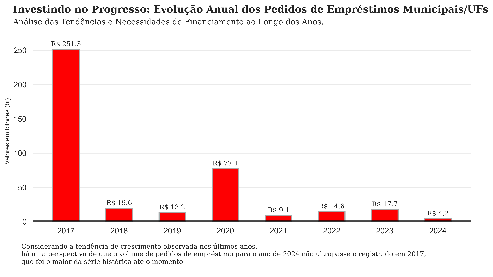
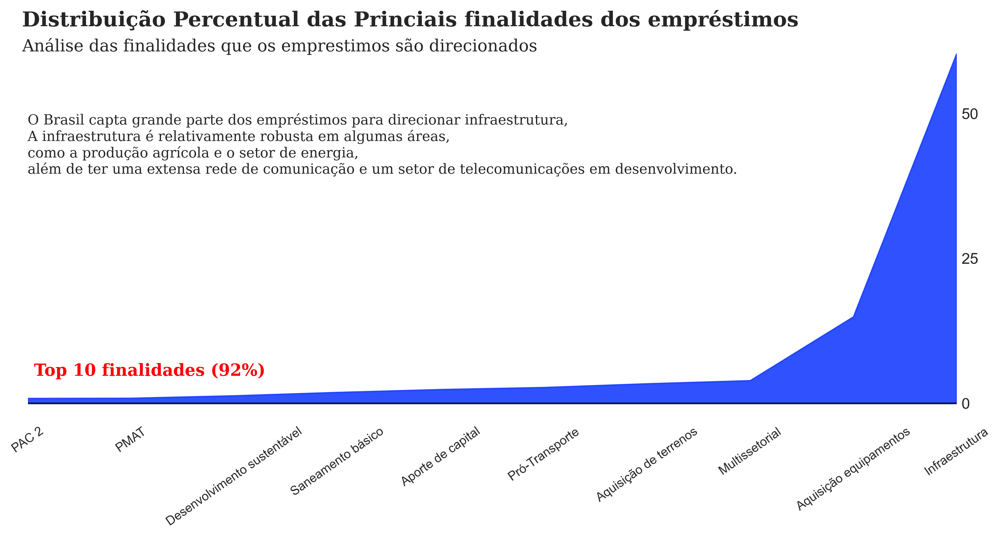
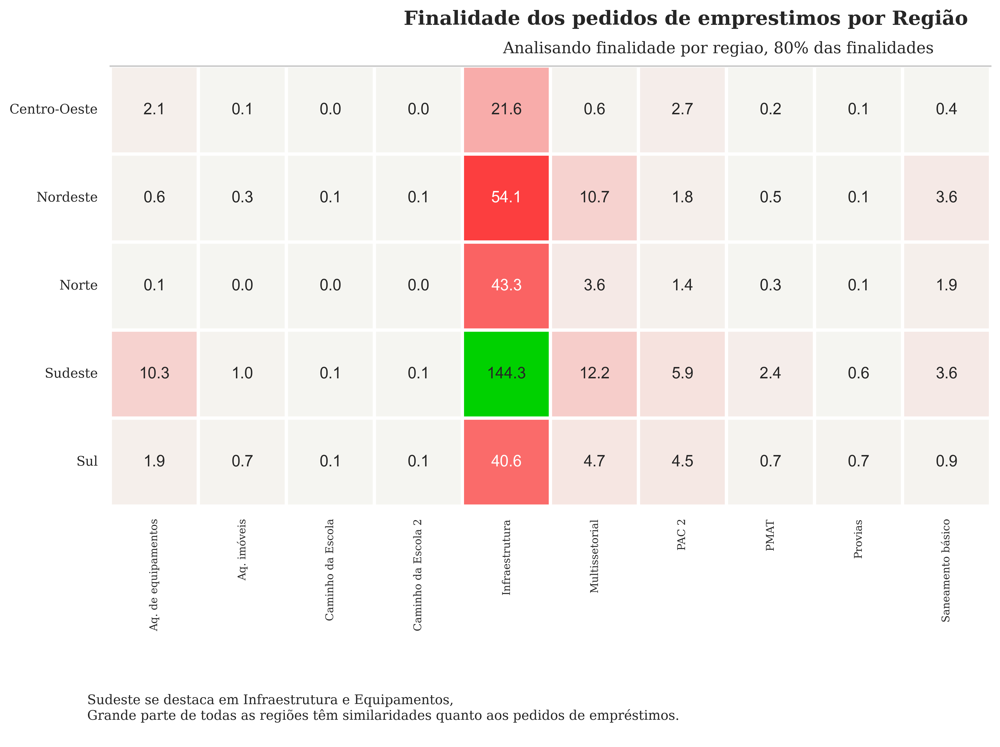
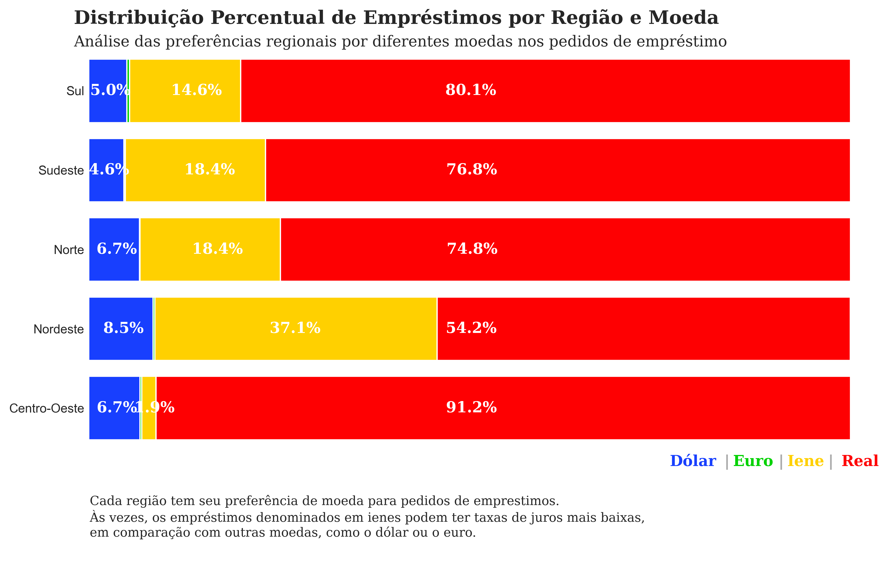

# Análise Exploratória dos Pedidos de Empréstimos Municipais e Estaduais no Brasil

Este projeto realiza uma análise detalhada dos pedidos de empréstimos realizados por municípios e estados no Brasil ao longo dos anos. O foco está nas tendências de financiamento, finalidades principais dos empréstimos, distribuição por regiões e preferências de moeda.

## Objetivo

O principal objetivo deste projeto é entender as tendências de financiamento no Brasil em nível municipal e estadual, além de identificar as principais finalidades dos empréstimos, distribuí-los por região e analisar as preferências de moeda ao longo dos anos.

## Estrutura dos Arquivos

- `an_exploratoria1.ipynb`: Notebook Jupyter contendo o código da análise exploratória e visualizações.
- `Analise-Anual.png`: Gráfico de barras com a evolução anual dos pedidos de empréstimo.
- `Analise-finalidades.png`: Gráfico mostrando a distribuição percentual das finalidades dos empréstimos.
- `Analise-finalidades-regiao.png`: Mapa de calor destacando as finalidades dos pedidos de empréstimos por região.
- `Analise-percentual.png`: Gráfico de barras empilhadas, mostrando a distribuição percentual dos empréstimos por região e moeda.
- `Base_Dados - Operacoes Uniao.csv`: Base de dados utilizada na análise com detalhes das operações de empréstimos.

## Visualizações

### 1. Evolução Anual dos Pedidos de Empréstimos

A análise mostra que o ano de 2017 teve o maior volume de pedidos de empréstimos, com R$ 251.3 bilhões. Outros picos notáveis ocorreram em 2020, com R$ 77.1 bilhões.

### 2. Distribuição Percentual das Finalidades dos Empréstimos

Este gráfico mostra que a maior parte dos empréstimos (92%) se concentra nas 10 finalidades principais, sendo "Infraestrutura" a mais relevante.

### 3. Finalidade dos Pedidos de Empréstimos por Região

O mapa de calor mostra a distribuição das finalidades dos empréstimos por região. O Sudeste se destaca com o maior volume em "Infraestrutura", enquanto o Nordeste e o Norte também têm volumes significativos.

### 4. Distribuição Percentual de Empréstimos por Região e Moeda

Este gráfico compara as preferências de moeda para os empréstimos em diferentes regiões do Brasil. O real é amplamente utilizado, seguido pelo iene, dólar e euro, com variações regionais.

## Base de Dados

A análise foi realizada utilizando a base de dados `Base_Dados - Operacoes Uniao.csv`, que contém detalhes sobre as operações de empréstimos realizados por municípios e estados no Brasil.

## Conclusões

- **Infraestrutura** é a principal finalidade dos empréstimos captados, refletindo as necessidades de desenvolvimento em diversas regiões.
- O **ano de 2017** foi o mais expressivo em termos de volume de empréstimos, seguido por 2020.
- As **regiões Sudeste, Nordeste e Norte** são as que mais captaram recursos, com foco em infraestrutura.
- Há uma preferência clara pelo uso do **Real**, mas algumas regiões optaram por empréstimos denominados em **Iene** e **Dólar**.

## Ferramentas Utilizadas

- **Linguagem de Programação**: Python
- **Bibliotecas**: Pandas, Matplotlib, Seaborn
- **Ambiente**: Jupyter Notebook
- **Visualizações**: Gráficos de barras, heatmap, gráficos de barras empilhadas
